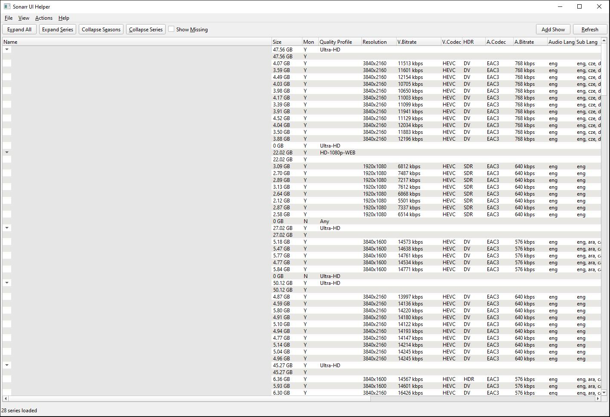

# Media Quality Checker & Sonarr UI Helper

A toolkit for managing your Sonarr/Radarr media libraries: browse/manage Sonarr series with a desktop GUI, and check files for English audio/subtitles.

## Tools Included

### 1. Sonarr UI Helper (`sonarr_ui_helper.py`)

PySide6 desktop application for browsing and managing your Sonarr library. Shows series, seasons, and episodes in a treeview with ffprobe media info (codecs, resolution, audio channels, subtitles). Supports manual/auto search, monitoring, file deletion, and adding new shows.



### 2. Media Quality Checker (`media_quality_checker.py`)

CLI script that scans all downloaded files in Sonarr and Radarr for English audio streams and subtitles. Files missing required language tracks are deleted and re-downloaded automatically.

## Requirements

- Python 3.9+
- ffmpeg/ffprobe installed and in PATH
- Sonarr and/or Radarr instances with API access

## Quick Start (Windows)

```cmd
wpythonpip.cmd                    &:: Install Python dependencies
sonarr_ui_helper_launch.cmd       &:: Run the Sonarr UI helper (GUI)
media_quality_checker_launch.cmd  &:: Run the media quality checker (CLI)
```

## Installation

Install Python dependencies:
```bash
pip install -r requirements.txt
```

Install ffmpeg (if not already installed):
```bash
# Ubuntu/Debian
sudo apt-get install ffmpeg

# macOS
brew install ffmpeg

# Windows - download from https://ffmpeg.org/download.html
```

## Configuration

Both tools share a `config.toml` file. Copy `config_example.toml` to `config.toml` and edit it:

```toml
[sonarr]
url = "http://localhost:8989"
api_key = "your_sonarr_api_key_here"
enabled = true
# http_basic_auth_username = ""
# http_basic_auth_password = ""

[radarr]
url = "http://localhost:7878"
api_key = "your_radarr_api_key_here"
enabled = true
# http_basic_auth_username = ""
# http_basic_auth_password = ""

[settings]
dry_run = false
interactive = true
require_english_audio = true
require_english_subs = true
english_language_codes = ["eng", "en", "english"]
# highlight_missing_subs = "english"
```

### Finding Your API Keys

1. Open Sonarr/Radarr web interface
2. Go to Settings -> General
3. Under "Security" section, find "API Key"

### HTTP Basic Auth

If Sonarr/Radarr sit behind a reverse proxy with HTTP Basic Auth, add credentials to the relevant section:

```toml
[sonarr]
http_basic_auth_username = "myuser"
http_basic_auth_password = "mypass"
```

### Configuration Options

- `dry_run` - Set to `true` to test without making changes
- `require_english_audio` - Require English audio (default: true)
- `require_english_subs` - Require English subtitles (default: true)
- `english_language_codes` - Language codes to consider as English
- `highlight_missing_subs` - Highlight episodes missing subtitles with a light red background in the UI. The value is a label (e.g. `"english"`) and any code from `english_language_codes` counts as a match
- `enabled` - Enable/disable Sonarr or Radarr processing independently

## Sonarr UI Helper

### Usage

```bash
python sonarr_ui_helper.py
```

### Features

- Tree view of all series, seasons, and episodes
- Monitored status column (Y/N) for series, seasons, and episodes
- ffprobe media info columns (video codec, resolution, audio codec/channels, subtitles)
- ffprobe results cached to `z_fprobe.cache` for fast reloads
- Configurable highlight for episodes missing subtitle languages
- Manual search dialog with release selection
- Auto search (trigger Sonarr automatic search)
- Add new shows with root folder and quality profile selection
- Monitor/unmonitor episodes
- Delete files from disk (with or without unmonitoring)
- Open file location in Explorer
- Show/hide missing (undownloaded) episodes
- Expand/collapse controls for series and seasons
- Resizable columns with remembered widths

### Keyboard Shortcuts

| Shortcut | Action |
|---|---|
| Ctrl+N | Add Show |
| F5 | Refresh |
| Ctrl+F5 | Clear Cache & Refresh |
| Ctrl+Q | Quit |
| Ctrl+E | Expand All |
| Ctrl+Shift+E | Expand Series |
| Ctrl+W | Collapse Seasons |
| Ctrl+Shift+W | Collapse All |
| Ctrl+M | Toggle Missing Episodes |
| Ctrl+Shift+R | Reset saved view state |
| M | Monitor Selected |
| S | Auto Search |
| N | Manual Search |
| Q | Change Quality Profile (series only) |
| U | Unmonitor Selected |
| D | Delete files from Disk (keep in Sonarr) |
| Delete | Remove series/season from Sonarr (deletes files) |
| Ctrl+Delete | Unmonitor & Delete |
| O | Open in Explorer |
| F1 | Keyboard Shortcuts Help |

### Context Menu

Right-click any item in the tree for quick access to all actions.

## Media Quality Checker

### Usage

```bash
python media_quality_checker.py
```

### How It Works

1. Connects to Sonarr and Radarr via their APIs
2. Retrieves all series/movies with downloaded files
3. Analyzes each file using ffprobe for English audio and subtitle streams
4. Deletes files missing required language tracks
5. Triggers automatic search to re-download better releases

### Interactive Mode

Set `interactive = true` in config.toml to manually choose alternative releases:

- Browse all available releases sorted by quality and size
- Filter releases by search term
- Skip and remember decisions across runs
- Choose specific releases to download

### Output Examples

#### File with English audio and subs:
```
  OK Some.Show.S01E01.1080p.BluRay.x264.mkv
```

#### File missing English content:
```
  X Some.Show.S01E01.1080p.BluRay.x264.mkv
     English audio: False, English subs: True
     Deleting file to trigger re-download...
     Triggering search...
```

#### Interactive mode:
```
X Issue found: Some Show (2024)
  File: Some.Show.S01E01.1080p.BluRay.x264.mkv
  English audio: NO
  English subs: YES

View alternative releases? [Y/n]: y

┌──────────────────────────────────────────────────────────────────────────┐
│                Available Releases for: Some Show (2024)                 │
├───┬──────────────────────────────────────────────────────┬─────────┬────────────┤
│ # │ Title                                                │ Size    │ Quality    │
├───┼──────────────────────────────────────────────────────┼─────────┼────────────┤
│ 1 │ Some.Show.2024.2160p.UHD.BluRay.REMUX-GRP           │ 68.9 GB │ Remux-2160p│
│ 2 │ Some.Show.2024.1080p.BluRay.REMUX-GRP               │ 25.3 GB │ Remux-1080p│
│ 3 │ Some.Show.2024.1080p.BluRay.x264-GRP                │ 12.5 GB │ Bluray-1080│
└───┴──────────────────────────────────────────────────────┴─────────┴────────────┘

Options: Enter release number, 's' to search, 'c' to clear, 0 to skip, -1 to keep
```

### Cache Files

- `z_user.cache` - Stores skip decisions permanently. Delete entries to re-evaluate.
- `z_files.cache` - Stores files that passed validation. Delete entries if files changed.

### Automation with Cron

```bash
# Run every day at 3 AM
0 3 * * * cd /path/to/script && python3 media_quality_checker.py >> /var/log/media_checker.log 2>&1
```

## Troubleshooting

### ffprobe not found
Make sure ffmpeg is installed and in your PATH:
```bash
ffprobe -version
```

### API connection errors
- Verify URLs are correct (include http:// or https://)
- Check API keys are valid
- Ensure Sonarr/Radarr are running and accessible

### Files not being detected
- Check file paths are correct
- Ensure the user running the script has read access to media files
- Verify ffprobe can read the file format

## Warning

The media quality checker will **delete and re-download** files. Always set `dry_run = true` in config.toml first to see what would happen!

---

### Tags

sonarr, sonarr ui, sonarr gui, sonarr qt, sonarr qt ui, sonarr pyside6, sonarr desktop app, sonarr desktop client, sonarr manager, sonarr episode manager, sonarr series browser, sonarr treeview, radarr, radarr ui, media quality checker, media language checker, english audio checker, english subtitle checker, ffprobe, ffmpeg, pyside6, qt6, sonarr api, radarr api, sonarr tool, sonarr utility, sonarr helper, media library manager, tv show manager, episode browser, sonarr search, sonarr monitor, sonarr delete, sonarr file manager
