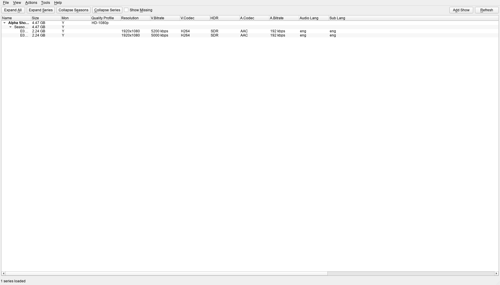
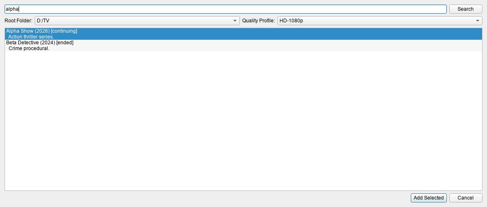
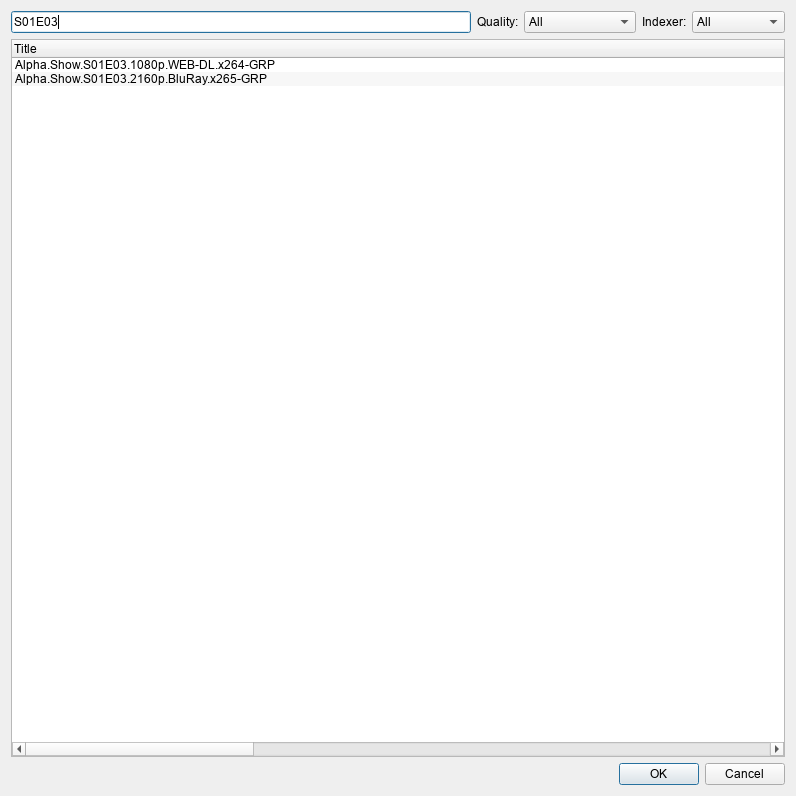

# Media Quality Checker & Sonarr UI Helper

A toolkit for managing Sonarr and Radarr libraries:
- `arr_helper.sonarr_ui.app`: desktop GUI for browsing/managing Sonarr content.
- `arr_helper.media_checker.app`: CLI checker for required English audio/subtitles.

## UI Walkthrough

1. Configure sources and review your Sonarr library tree.

   

   Overview of series/seasons/episodes with monitored-state and metadata columns.

2. Execute add-show workflow with explicit root/profile choices.

   

   Add-show dialog state used to onboard new series into your managed library.

3. Review manual-search candidates and execute the selected action.

   

   Manual-search dialog state for choosing and sending the best release to Sonarr.

## Tools Included

### 1. Sonarr UI Helper (`arr_helper.sonarr_ui.app`)

PySide6 desktop app for browsing and managing Sonarr series, seasons, and episodes.

Key capabilities:
- Tree view with series/season/episode hierarchy
- Monitored status editing
- ffprobe metadata columns (resolution, bitrates, codecs, HDR, languages)
- Manual and auto search actions
- File deletion workflows (delete from disk, unmonitor + delete)
- Add new show with root folder and quality profile selection
- Open selected path in system file explorer

### 2. Media Quality Checker (`arr_helper.media_checker.app`)

CLI tool that scans downloaded files in Sonarr/Radarr for required English audio/subtitle streams.

Behavior:
- `dry_run = true`: no destructive changes; reports only
- `dry_run = false`: files failing requirements are deleted and search commands are triggered
- `interactive = true`: lets you view/select alternative releases or skip

## Requirements

- Python 3.10+
- ffmpeg/ffprobe installed and available in PATH
- Sonarr and/or Radarr with API access

Python dependencies are defined in `pyproject.toml`.

## Installation

```bash
uv sync --all-extras
```

Fallback (pip):

```bash
python -m pip install -e .[dev]
```

Both installs register console scripts: `sonarr-ui-helper` and `media-quality-checker`.

Install ffmpeg if needed:
```bash
# Ubuntu/Debian
sudo apt-get install ffmpeg

# macOS
brew install ffmpeg

# Windows
# download from https://ffmpeg.org/download.html
```

## Quick Start (Windows)

```cmd
uv sync --all-extras
python scripts\windows\run_app.py
python -m arr_helper.media_checker.app
```

## Configuration

Both tools use the standardized TOML config contract:

- `config/app.defaults.toml` (tracked defaults)
- `config/app.example.toml` (tracked template)
- `config/app.local.toml` (your untracked local overrides)
- optional secret file: `%APPDATA%/arr-helper-ui/secrets.toml` (Windows) or `~/.config/arr-helper-ui/secrets.toml` (Linux/macOS)

1. Copy `config/app.example.toml` to `config/app.local.toml`
2. Fill in Sonarr/Radarr URLs and API keys
3. Enable/disable each service with its `enabled` flag

Example:

```toml
[sonarr]
url = "http://localhost:8989"
api_key = "your-sonarr-api-key-here"
enabled = true
# http_basic_auth_username = ""
# http_basic_auth_password = ""

[radarr]
url = "http://localhost:7878"
api_key = "your-radarr-api-key-here"
enabled = true
# http_basic_auth_username = ""
# http_basic_auth_password = ""

[settings]
# safety switch for arr_helper.media_checker.app
dry_run = false

# interactive release selection mode in arr_helper.media_checker.app
interactive = true

# language requirements for arr_helper.media_checker.app
require_english_audio = true
require_english_subs = true
english_language_codes = ["eng", "en", "english"]

# Highlight episodes missing subtitles (light red background in UI).
# The value is a label; matching is done against english_language_codes.
# highlight_missing_subs = "english"
```

### Finding API Keys

1. Open Sonarr/Radarr web UI
2. Go to `Settings -> General`
3. Find `API Key` in the Security section

### HTTP Basic Auth (Optional)

If your services are behind a reverse proxy with HTTP Basic Auth:

```toml
[sonarr]
http_basic_auth_username = "myuser"
http_basic_auth_password = "mypass"
```

## Sonarr UI Helper

### Run

```bash
python -m arr_helper
# equivalent explicit GUI entrypoint:
python -m arr_helper.sonarr_ui.app
# or installed script:
sonarr-ui-helper
```

### Display Columns

- Name
- Size
- Mon
- Quality Profile
- Resolution
- V.Bitrate
- V.Codec
- HDR
- A.Codec
- A.Bitrate
- Audio Lang
- Sub Lang

### Manual Search Dialog

Pressing **N** on an episode/season/series opens a Manual Search dialog that lists
available releases from indexers. The dialog supports:

- Text filter with autocomplete from previous searches
- Quality and Indexer dropdown filters
- Sortable columns: Title, Size (GB), Quality, Indexer, Age
- Double-click a release row to download it

### Keyboard Shortcuts

| Shortcut | Action |
|---|---|
| **General** | |
| Ctrl+N | Add Show |
| F5 | Refresh |
| Ctrl+F5 | Clear cache and refresh |
| Ctrl+Q / Alt+X | Quit |
| **Navigation** | |
| Enter | Open file/folder in Explorer |
| O | Open in Explorer |
| Double-click | Open file/folder |
| Delete | Remove series/season from Sonarr (deletes files) |
| **View** | |
| Ctrl+E | Expand all (except Specials) |
| Ctrl+Shift+E | Expand series only |
| Ctrl+W | Collapse seasons |
| Ctrl+Shift+W | Collapse all |
| Ctrl+M | Toggle missing episodes |
| Ctrl+Shift+R | Reset saved view state |
| **Actions** | |
| M | Monitor selected |
| S | Auto search |
| N | Manual search |
| Q | Change quality profile (series) |
| U | Unmonitor selected |
| D | Delete from disk (keep in Sonarr) |
| Ctrl+Delete | Unmonitor and delete from disk |
| F1 | Shortcut help |

### Menus

- **File** — Add Show, Refresh, Clear Cache & Refresh, Quit
- **View** — Show Missing, Fit Columns, Reset View
- **Actions** — Monitor, Auto Search, Manual Search, Change Quality Profile, Unmonitor, Delete from Disk, Unmonitor & Delete, Open in Explorer
- **Tools** — Edit .ini file (opens the QSettings INI in your default editor)
- **Help** — Keyboard Shortcuts

## Media Quality Checker

### Run

```bash
# media checker stays a manual CLI command:
python -m arr_helper.media_checker.app
# or installed script:
media-quality-checker
```

### Processing Flow

1. Fetch series/movies from enabled services
2. Inspect file streams via ffprobe
3. Check against configured language requirements
4. If failing:
   - non-interactive: delete file + trigger search
   - interactive: let user choose alternative, skip, or keep
5. Cache decisions/results for future runs

### Safety Notes

- Run with `dry_run = true` first.
- In non-dry-run mode, this tool can delete files.
- Interactive mode can permanently remember skip decisions.

### Example (Interactive)

```text
X Issue found: Some Show (2024)
  File: Some.Show.S01E01.1080p.BluRay.x264.mkv
  English audio: NO
  English subs: YES

View alternative releases? [Y/n]: y

1) Some.Show.2024.2160p.UHD.BluRay.REMUX-GRP   68.9 GB   Remux-2160p
2) Some.Show.2024.1080p.BluRay.REMUX-GRP       25.3 GB   Remux-1080p
3) Some.Show.2024.1080p.BluRay.x264-GRP        12.5 GB   Bluray-1080

Options: Enter release number, 's' to search, 'c' to clear, 0 to skip, -1 to keep
```

## Project Structure

```text
arr-helper-ui/
|-- pyproject.toml
|-- uv.lock
|-- src/
|   `-- arr_helper/
|       |-- __init__.py
|       |-- core/
|       |   |-- ffprobe.py
|       |   |-- locking.py
|       |   |-- paths.py
|       |   `-- toml_compat.py
|       |-- sonarr_ui/
|       |   |-- api.py
|       |   |-- app.py                   # Desktop GUI entrypoint
|       |   |-- helpers.py
|       |   |-- main_window.py
|       |   |-- probe_cache.py
|       |   |-- roles.py
|       |   |-- workers.py
|       |   `-- dialogs/
|       |       |-- add_show.py
|       |       `-- manual_search.py
|       `-- media_checker/
|           |-- app.py                   # CLI checker entrypoint
|           |-- checker.py
|           `-- config.py
|-- config/
|   |-- app.defaults.toml                # Tracked non-secret defaults
|   `-- app.example.toml                 # Configuration template
|-- .pre-commit-config.yaml
|-- .github/workflows/ci.yml
|-- docs/
|   |-- development.md
|   |-- images/
|   |   |-- ui-01-overview.png
|   |   |-- ui-02-workflow.png
|   |   `-- ui-03-details.png
|   `-- release-checklist.md
|-- tests/
|   |-- conftest.py                      # Pytest fixtures (headless Qt setup)
|   |-- test_sonarr_ui_helper_unit.py
|   |-- test_sonarr_ui_helper_qt.py
|   `-- test_media_quality_checker_unit.py
|-- scripts/
|   `-- windows/
|       |-- run_app.py                  # Standard app launcher (python -m arr_helper)
|       |-- run_app_gui.pyw              # Standard GUI launcher
|       `-- run_tests.py                # Standard test runner
```

## Testing

```bash
uv run pytest
```

## Quality Checks

```bash
uv run ruff check .
uv run mypy src
uv run python -m build
uv run pip-audit
```

## Pre-commit

```bash
uv run pre-commit install
uv run pre-commit run --all-files
```

Tests run headless (`QT_QPA_PLATFORM=offscreen`) and cover API interaction,
cache logic, Qt window lifecycle, and the quality checker's decision logic.

## Cache Files

Cache/state files are stored under the system temp directory in `temp_arr_helper_ui`.
If that directory cannot be created, the tools fall back to their local runtime directory.

Examples:
- Windows: `%TEMP%\temp_arr_helper_ui\`
- Linux/macOS: `${TMPDIR:-/tmp}/temp_arr_helper_ui/`

Files:
- `z_fprobe.cache` - ffprobe metadata cache used by `arr_helper.sonarr_ui.app`
- `z_user.cache` - persistent skip decisions used by `arr_helper.media_checker.app`
- `z_files.cache` - list of files already validated as good by `arr_helper.media_checker.app`

## Automation (cron example)

```bash
# Run every day at 3 AM
0 3 * * * cd /path/to/script && PYTHONPATH=src python3 -m arr_helper.media_checker.app >> /var/log/media_checker.log 2>&1
```

## Troubleshooting

### ffprobe not found

On Windows the tools automatically search common install locations
(Chocolatey, Scoop, WinGet, `C:\ffmpeg`, etc.) even if ffprobe is not in PATH.

Verify ffprobe is available:

```bash
ffprobe -version
```

### API connection errors

- Verify URLs include `http://` or `https://`
- Verify API keys are valid
- Confirm Sonarr/Radarr are reachable

### Config issues

- Ensure `config/app.local.toml` exists (or set `APP_CONFIG_PATH`)
- Ensure at least one of `[sonarr].enabled` or `[radarr].enabled` is `true`

## Warning

`arr_helper.media_checker.app` can delete and re-download files. Validate settings with `dry_run = true` before real runs.

---

<!-- legal-disclaimer:start -->
## Legal Disclaimer

THIS SOFTWARE IS PROVIDED "AS IS" AND "AS AVAILABLE," WITHOUT WARRANTIES OF ANY KIND, WHETHER EXPRESS, IMPLIED, STATUTORY, OR OTHERWISE, INCLUDING, WITHOUT LIMITATION, ANY IMPLIED WARRANTIES OF MERCHANTABILITY, FITNESS FOR A PARTICULAR PURPOSE, TITLE, NON-INFRINGEMENT, ACCURACY, OR QUIET ENJOYMENT. TO THE MAXIMUM EXTENT PERMITTED BY APPLICABLE LAW, THE AUTHORS, CONTRIBUTORS, MAINTAINERS, DISTRIBUTORS, AND AFFILIATED PARTIES SHALL NOT BE LIABLE FOR ANY DIRECT, INDIRECT, INCIDENTAL, SPECIAL, CONSEQUENTIAL, EXEMPLARY, OR PUNITIVE DAMAGES, OR FOR ANY LOSS OF DATA, PROFITS, GOODWILL, BUSINESS OPPORTUNITY, OR SERVICE INTERRUPTION, ARISING OUT OF OR RELATING TO THE USE OF, OR INABILITY TO USE, THIS SOFTWARE, EVEN IF ADVISED OF THE POSSIBILITY OF SUCH DAMAGES. THIS SOFTWARE HAS BEEN DEVELOPED, IN WHOLE OR IN PART, BY "INTELLIGENT TOOLS"; ACCORDINGLY, OUTPUTS MAY CONTAIN ERRORS OR OMISSIONS, AND YOU ASSUME FULL RESPONSIBILITY FOR INDEPENDENT VALIDATION, TESTING, LEGAL COMPLIANCE, AND SAFE OPERATION PRIOR TO ANY RELIANCE OR DEPLOYMENT.
<!-- legal-disclaimer:end -->
